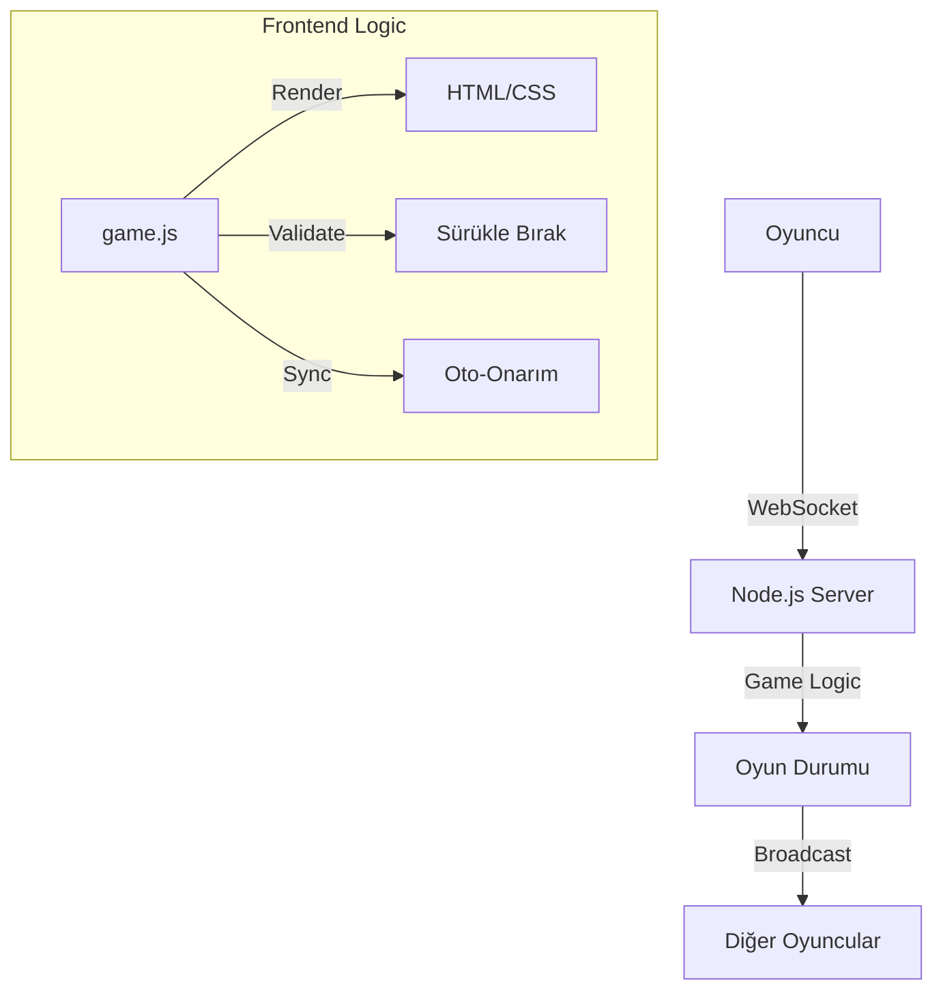

<div align="center">
  
  <br>
  
  # 🎴 101 Okey Online - Premium Experience

  **Modern, Hızlı ve Akıllı.**<br>
  Web teknolojilerinin sınırlarını zorlayan, Socket.IO tabanlı gerçek zamanlı 101 Okey deneyimi.
  
  [Özellikler](#-özellikler) • [Kurulum](#-kurulum) • [Teknolojiler](#-teknolojiler) • [Oynanış](#-oynanış)

  
  
  
</div>

---

## ✨ Proje Hakkında

Bu proje, geleneksel 101 Okey oyununu modern web arayüzü ve güçlü bir sunucu altyapısı ile dijital dünyaya taşır. Sadece bir oyun değil, aynı zamanda **"Self-Healing" (Kendi Kendini Onaran)** senkronizasyon yeteneğine sahip akıllı bir sistemdir.

### 🌟 Öne Çıkan Yenilikler (v1.1)
- **🛠️ Self-Repair Sync Engine:** Bağlantı kopmasa bile oyun mantığında senkron kayması (desync) olursa, sistem bunu milisaniyeler içinde fark eder ve oyuncuyu hissettirmeden oyuna tekrar senkronize eder.
- **👆 Gelişmiş Drag & Drop:** Hem dokunmatik ekranlarda hem de mouse ile kusursuz çalışan, `sol cepten çekme` dahil tam kapsamlı sürükle-bırak desteği.
- **🎨 Glassmorphism Tasarım:** Arka planda blur efektleri, canlı gradyanlar ve 3D derinlik hissi veren ıstaka tasarımı.

---

## 💎 Özellikler

### 🎮 Oyun Deneyimi
- **4 Kişilik Gerçek Zamanlı Oyun:** Arkadaşlarınızla veya botlarla (hazırlık aşamasında) anlık kapışma.
- **Akıllı Istaka:** 
  - Taşları otomatik gruplama (Seri/Per).
  - Puanı anlık hesaplama.
  - Elinizdeki taşlar 101'e ulaştığında butonun yanması.
- **Ceza Sistemi:** Yanlış hamlelerde, işler taş atıldığında veya hatalı el açma girişimlerinde kurallara uygun ceza puanı (+101).
- **Domates Fırlatma 🍅:** Rakibinizi kızdırmak için eğlenceli interaktif efektler!

### ⚙️ Teknik Derinlik
- **Robust State Management:** Sunucu (`server/gameLogic.js`) oyunun tek gerçeklik kaynağıdır. İstemci sadece görselleştirmeyi yapar.
- **Olay Tabanlı Mimari:** Socket.IO event'leri ile asenkron ve ölçeklenebilir iletişim.
- **Güvenli Oynanış:** İstemci tarafında yapılan hile girişimleri (taş çalma, sırasız oynama) sunucu tarafından reddedilir.

---

## 🚀 Kurulum ve Çalıştırma

Projeyi yerel makinenizde çalıştırmak için aşağıdaki adımları izleyin.

### Gereksinimler
- [Node.js](https://nodejs.org/) (v14 veya üzeri)
- Modern bir web tarayıcısı (Chrome, Edge, Firefox, Safari)

### Adım Adım Kurulum

1. **Projeyi Klonlayın**
   ```bash
   git clone https://github.com/boradmir/online-101-okey-demo.git
   cd online-101-okey-demo
   ```

2. **Bağımlılıkları Yükleyin**
   ```bash
   npm install
   ```

3. **Sunucuyu Başlatın**
   ```bash
   npm start
   # veya
   node server/index.js
   ```

4. **Oyuna Girin**
   Tarayıcınızda `http://localhost:3000` adresine gidin.
   *İpucu: Test etmek için farklı sekmelerde veya Gizli Pencere'de 4 farklı oyuncu olarak girebilirsiniz.*

---

## 📂 Proje Mimarisi



### Dosya Yapısı
- `public/js/game.js`: Oyunun beyni. 2700+ satırlık istemci mantığı.
- `server/gameLogic.js`: Kuralların hakimi. Geçerli hamle kontrolü.
- `public/css/style.css`: Görsel şölen. 1500+ satırlık detaylı stil dosyası.

---

## 🎲 Hızlı Kurallar

1. **Amaç:** Elinizdeki taşları per (7-7-7) veya seri (5-6-7) yaparak toplam puanı 101'e ulaştırmak ve el açmak.
2. **Başlangıç:** Herkese 21 taş dağıtılır. Başlayana 22 taş verilir, o taş çekmeden atar.
3. **Akış:**
   - Sırası gelen **yığından** veya **solundaki oyuncunun attığı taştan** çeker.
   - Elindeki işe yaramayan bir taşı **sağına** atar.
4. **Bitiş:** Elini açtıktan sonra elinde kalan son taşı boşa atarak oyunu bitirir.

---

## 🤝 Katkıda Bulunma

Projeye katkıda bulunmak isterseniz çok mutlu oluruz!

1. Fork'layın 🍴
2. Feature branch oluşturun (`git checkout -b feature/AmazingFeature`)
3. Commit yapın (`git commit -m 'Add some AmazingFeature'`)
4. Push'layın (`git push origin feature/AmazingFeature`)
5. Pull Request açın 📬

---

<div align="center">
  <p>Made with ❤️ by <b>Bora</b></p>
  <p>
    <a href="https://github.com/boradmir">GitHub Profilim</a>
  </p>
</div>
